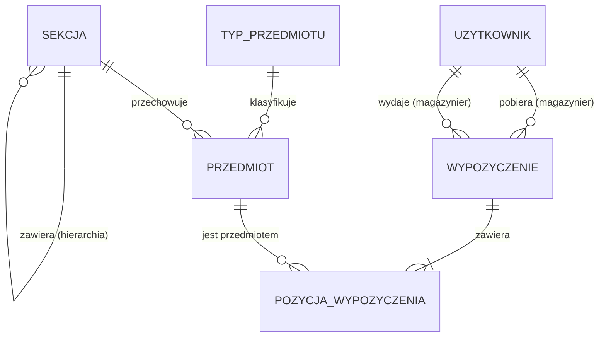

```mermaid
erDiagram
    SEKCJA                ||--o{ SEKCJA               : "zawiera (hierarchia)"

    TYP_PRZEDMIOTU        ||--o{ PRZEDMIOT            : "klasyfikuje"
    SEKCJA                ||--o{ PRZEDMIOT            : "przechowuje"

    UZYTKOWNIK            ||--o{ WYPOZYCZENIE         : "pobiera (magazynier)"
    UZYTKOWNIK            ||--o{ WYPOZYCZENIE         : "wydaje (magazynier)"
    WYPOZYCZENIE          ||--|{ POZYCJA_WYPOZYCZENIA : "zawiera"
    PRZEDMIOT             ||--o{ POZYCJA_WYPOZYCZENIA : "jest przedmiotem"
```
